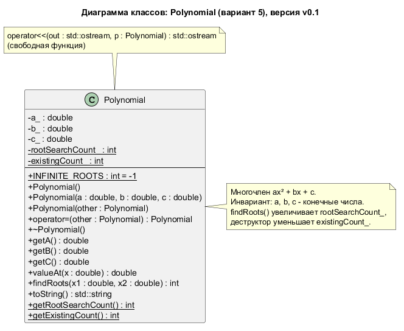

# Лабораторная работа №3 по ООП

[](https://github.com/Vareshka86/Lab3_OOP_try1/releases)

Калькулятор многочленов 2-й степени с перегрузкой операторов на C++14 — консольная программа по лабораторной работе №3.

Программа выполняет [лабораторную работу №3](https://aleksandr-003.github.io/labs/OOP_z/Labs1_3.html) курса «Объектно-ориентированное программирование и проектирование» (А. Д. Смородинов), вариант 5 — калькулятор многочленов вида ax² + bx + c, класс `Polynomial`. Работа сдаётся по частям: каждая часть выходит отдельной версией. Сейчас выполнены части 1 и 2 из 3: класс с тремя конструкторами, деструктором и статическими полями, поиск корней и счётчик поисков, перегрузка инкремента, декремента и арифметики.

```console
$ .\build\lab3.exe
...
  P = x² - 3x + 2
  Q = x² + x + 1
...
Ваш выбор: 9
P + Q = 2x² - 2x + 3
P - Q = -4x + 1
(P и Q не изменились)
...
Ваш выбор: 14
k = 0
Ошибка: деление на ноль. Многочлены не изменились.
...
Ваш выбор: 15
...
Ваш выбор: 2
До:     P = 1.5x² - 0.5x + 2
P++ вернул: 1.5x² - 0.5x + 2   (прежнее значение)
После:  P = 2.5x² + 0.5x + 3
```

*Сложение и вычитание многочленов, отказ при делении на ноль и постфиксный инкремент, который возвращает прежнее значение. Повторы меню сокращены до `...`.*



*Диаграмма классов в PlantUML (исходник — `uml/Polynomial.puml`).*

## Части работы

| № | Что требуется | Версия | Статус |
|---|---------------|--------|--------|
| 1 | Три конструктора, деструктор, статические поля; значение в точке, поиск корней, счётчик поисков; меню | [v0.1](https://github.com/Vareshka86/Lab3_OOP_try1/releases/tag/v0.1) | Выполнено |
| 2 | Перегрузка `++`/`--` (префиксные и постфиксные), `+=`, `-=`, `*=`, `/=`, бинарных `+`, `-`, `*`, `/` через них | [v0.2](https://github.com/Vareshka86/Lab3_OOP_try1/releases/tag/v0.2) | Выполнено |
| 3 | Перегрузка сравнений `<`, `>`, `<=`, `>=`, `==`, `!=` при заданном x; демонстрация всех операций | — | Запланировано |

## Требования

- Компилятор g++ с поддержкой C++14. Проверено на g++ 16.2.0 (MinGW-w64, Windows 10).
- Doxygen — для сборки документации, необязательно. Проверено на версии 1.18.0.
- PlantUML — чтобы перерисовать диаграмму классов, необязательно. Проверено на версии 1.2026.8 (Java 8).

## Установка

```bash
git clone https://github.com/Vareshka86/Lab3_OOP_try1.git
cd Lab3_OOP_try1
```

Без git: откройте [Releases](https://github.com/Vareshka86/Lab3_OOP_try1/releases), скачайте архив **Source code (zip)** нужной версии и распакуйте его. Обновить клонированный репозиторий: `git pull`.

## Сборка и запуск

**Windows** (cmd или PowerShell):

```console
$ .\build.bat
Сборка успешна: build\lab3.exe
```

```powershell
.\build\lab3.exe
```

Что произошло:

- `build.bat` собрал программу из файлов папки `src` с флагами `-std=c++14 -Wall -Wextra -pedantic -static`; предупреждений компилятора нет.
- Флаг `-static` встраивает библиотеки MinGW в `lab3.exe`, поэтому программа запускается и на компьютере без компилятора.

**Linux и macOS** — на этих системах сборка не проверялась:

```bash
g++ -std=c++14 -Wall -Wextra -pedantic -Iinclude src/*.cpp -o lab3
./lab3
```

## Как это работает

Класс `Polynomial` хранит коэффициенты a, b, c многочлена ax² + bx + c. Три конструктора создают нулевой многочлен, многочлен по коэффициентам (с проверкой, что они конечные) и копию другого многочлена. Значение в точке считается по схеме Горнера, а `findRoots` разбирает все случаи: два корня, один, ни одного, линейное уравнение и «любое число».

Статическое поле `rootSearchCount_` общее для всех многочленов и считает вызовы поиска корней с запуска программы, как требует вариант 5. Второе статическое поле, `existingCount_`, увеличивают конструкторы и уменьшает деструктор, поэтому программа знает, сколько многочленов существует сейчас.

Перегруженные `++` и `--` меняют все коэффициенты на 1: префиксная форма возвращает ссылку на изменённый объект, постфиксная — копию прежнего значения. `+=` и `-=` складывают и вычитают многочлены, `*=` и `/=` умножают и делят на число. Бинарные `+`, `-`, `*`, `/` реализованы через составное присваивание, как требует задание: левый операнд передаётся по значению, копия меняется через `+=` (или `-=`, `*=`, `/=`) и возвращается. Деление на ноль и переполнение вызывают исключение, и многочлен остаётся прежним.

Подробное описание — на страницах [«Часть 1. Класс Polynomial»](pages/part1.md) и [«Часть 2. Перегрузка унарных и арифметических операций»](pages/part2.md).

## Документация

Комментарии в коде оформлены для Doxygen. Соберите документацию:

```bash
doxygen Doxyfile
```

Откройте `docs/html/index.html`. Сборка проходит без предупреждений. Диаграмма классов в документации — готовая картинка `uml/Polynomial.png`, поэтому для сборки документации PlantUML не нужен. Перерисовать картинку после правки `uml/Polynomial.puml`:

```bash
java -jar plantuml.jar -charset UTF-8 -tpng uml/Polynomial.puml
```

Что изменилось в каждой версии — в [CHANGELOG.md](CHANGELOG.md).

## Версии

Каждая часть выполняется в отдельной ветке (`part1`, …), исправления — в ветках `fix-…`. Готовая ветка сливается в `main`, и на результат ставится метка версии: [список версий](https://github.com/Vareshka86/Lab3_OOP_try1/releases).

---

Выполнил: Vareshka86.
